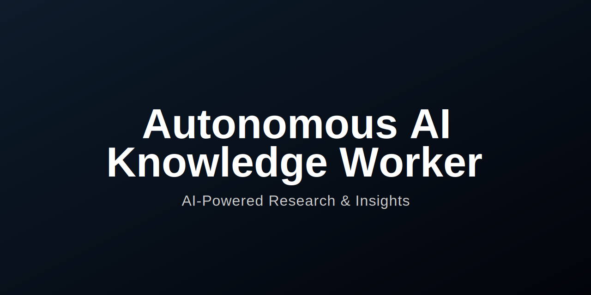

<div align="center">
  
</div>

<div align="center">
  <p align="center">
    An AI-powered system that autonomously researches topics, generates insights, and maintains a searchable knowledge base.
    <br />
    <a href="#-features"><strong>Explore the features »</strong></a>
    <br />
    <br />
  </p>
</div>

<div align="center">
  
  
  
  
</div>

---

<br/>

<div align="center">
  

[Image of the application dashboard UI]

</div>

<br/>

The Knowledge Vessel is a full-stack web application designed to act as an automated research assistant. It fetches, processes, and summarizes information from the web, providing users with actionable insights on a professional, interactive dashboard.

---

## ✨ Features

-   **🤖 Autonomous Research**: Fetches and processes information from multiple news sources (GNews, NewsData.io, RSS) with a resilient fallback system.
-   **📝 AI-Powered Summarization**: Utilizes Hugging Face models to generate concise, abstractive summaries for articles.
-   **🔑 Automatic Topic Extraction**: Employs Natural Language Processing to identify and tag key topics and entities.
-   **🧠 Vector Knowledge Base**: Stores article information in a Qdrant vector database for semantic "search by meaning" functionality.
-   **📈 Financial Data Integration**: Fetches and displays detailed stock market data using the `yfinance` library.
-   **🖥️ Modern Tech Stack**: Built with a robust FastAPI backend and a responsive Next.js frontend.

---

## 🛠️ Built With

-   **Frontend**: Next.js, React, TypeScript, TailwindCSS
-   **Backend**: Python, FastAPI
-   **Database**: PostgreSQL & Qdrant (via Docker)
-   **AI/ML**: Hugging Face, Sentence-Transformers, TextBlob
-   **Data Sources**: GNews API, NewsData.io API, `yfinance`, RSS Feeds

---

## 🚀 Getting Started

Follow these instructions to set up and run the project on your local machine.

### Prerequisites

Make sure you have the following software installed on your system:
* [Git](https://git-scm.com/)
* [Python 3.10+](https://www.python.org/)
* [Node.js (LTS)](https://nodejs.org/)
* [Docker Desktop](https://www.docker.com/products/docker-desktop/)

### Installation

1.  **Clone the Repository**
    ```sh
    git clone [https://github.com/akasuman/autonomous-ai-worker.git](https://github.com/akasuman/autonomous-ai-worker.git)
    cd autonomous-ai-worker
    ```

2.  **Launch Databases with Docker**
    Start Docker Desktop, then run the following command from the project's root folder to start the PostgreSQL and Qdrant containers.
    ```sh
    docker-compose up -d
    ```

3.  **Backend Setup**
    * Navigate to the backend directory:
        ```sh
        cd backend
        ```
    * Create a `.env` file for your secret keys. You will need keys from [GNews](https://gnews.io/), [NewsData.io](https://newsdata.io/), and [Hugging Face](https://huggingface.co/).
        * **On Windows (PowerShell):**
            ```powershell
            New-Item -Path ".env" -ItemType File
            ```
        * **On macOS/Linux:**
            ```sh
            touch .env
            ```
    * Open the new `.env` file and add your keys:
        ```env
        GNEWS_API_KEY="your_gnews_key_here"
        NEWSDATA_API_KEY="your_newsdata_key_here"
        HUGGINGFACE_TOKEN="your_huggingface_token_here"
        ```
    * Create and activate a Python virtual environment:
        * **On Windows (PowerShell):**
            ```powershell
            python -m venv venv
            .\venv\Scripts\activate
            ```
        * **On macOS/Linux:**
            ```sh
            python3 -m venv venv
            source venv/bin/activate
            ```
    * Install Python dependencies:
        ```sh
        pip install -r requirements.txt
        ```

4.  **Frontend Setup**
    * Navigate to the frontend directory from the root folder:
        ```sh
        cd ../frontend 
        ```
    * Install the Node.js dependencies:
        ```sh
        npm install
        ```

---

## 🏃‍♀️ Running the Application

You will need two separate terminals to run the backend and frontend servers simultaneously.

### Terminal 1: Run the Backend

```sh
# Navigate to the backend directory from the root
cd backend

# Activate the virtual environment if it's not already active
# On Windows:
.\venv\Scripts\activate
# On macOS/Linux:
# source venv/bin/activate

# Start the FastAPI server
uvicorn app.main:app --reload
✅ The backend should now be running at http://localhost:8000.

Terminal 2: Run the Frontend
Bash

# Navigate to the frontend directory from the root
cd frontend

# Start the Next.js development server
npm run dev
✅ The frontend should now be running at http://localhost:3000.

🗺️ Roadmap
[ ] Implement user authentication and role-based access.

[ ] Add voice-based queries for initiating research tasks.

[ ] Integrate additional data sources (e.g., scientific papers, social media).

[ ] Develop a more advanced analytics and visualization dashboard.

See the open issues for a full list of proposed features (and known issues).

🤝 Contributing
Contributions are what make the open-source community such an amazing place to learn, inspire, and create. Any contributions you make are greatly appreciated.

If you have a suggestion that would make this better, please fork the repo and create a pull request. You can also simply open an issue with the tag "enhancement".

Fork the Project

Create your Feature Branch (git checkout -b feature/AmazingFeature)

Commit your Changes (git commit -m 'Add some AmazingFeature')

Push to the Branch (git push origin feature/AmazingFeature)

Open a Pull Request

📜 License
Distributed under the MIT License.

📧 Contact
Suman - suman.k.332003@gmail.com

Project Link: https://github.com/akasuman/autonomous-ai-worker